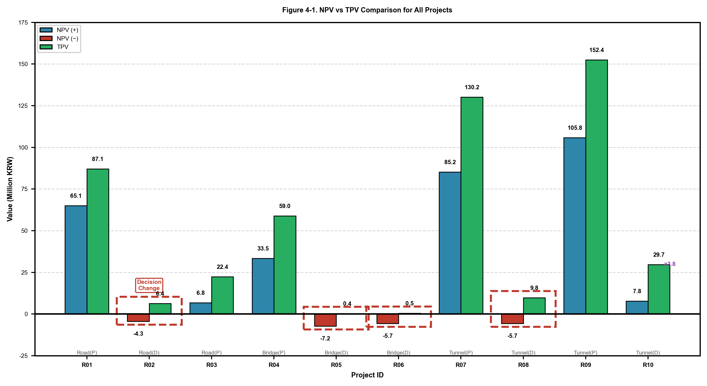
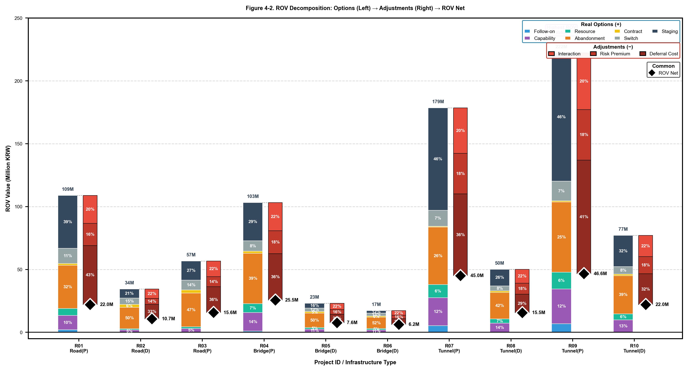
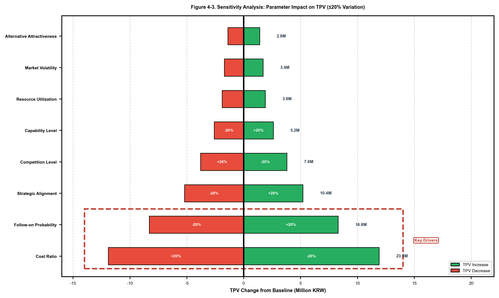

# BIM 실물옵션 가치평가 모델 (BIM-ROVS)

[](https://www.python.org/)
[](LICENSE)

**실물옵션 기반의 BIM 엔지니어링 프로젝트 입찰 참여여부 의사결정 지원 모형**

> **[English README](README.md)**

---

## 개요

공공 BIM 발주 의무화로 입찰 경쟁이 심화되면서 엔지니어링사는 제한된 인력·시간 내에서 기대 이익이 가장 큰 프로젝트를 선별해 참여할 필요가 있습니다. 그러나 기존 현금흐름할인법(DCF)은 시장 환경 변화에 따라 사업을 확장·축소·중단하는 등 경영적 유연성(Managerial Flexibility)을 발휘할 수 있는 권리의 가치를 반영하지 못해, 단기 수익성은 낮지만 장기 성장 잠재력이 큰 프로젝트가 저평가되는 문제가 있습니다.

본 모델은 입찰 전 단계에서 후속 사업 참여 기회, 기술역량 축적 등 '기회 요인'을 포함해 참여 여부를 정량적으로 판단하도록 돕는 실물옵션 기반 의사결정 지원 모형입니다.

### 핵심 개념: TPV = NPV + ROV

```
총 프로젝트 가치 (TPV) = 순현재가치 (NPV) + 실물옵션 가치 (ROV)     ... Eq.(1)

Where:
  ROV = Σ(7가지 옵션) - Σ(3가지 조정요소)                          ... Eq.(2)
```

- **NPV**: 확정적 수익 - 전통적 현금흐름 할인법 기반 (Eq.12)
- **ROV**: 기회 가치 - 7개 실물옵션 가치의 합계에서 3개 조정요소 차감

---

## 주요 기능

### 5-Level 계층적 프레임워크 (Figure 1)

입력 데이터의 불확실성을 체계적으로 관리하는 5단계 계층 시스템:

```
Level 1        Level 2           Level 3            Level 4        Level 5
데이터 입력 → 파라미터 매핑 →  확률 모형화   →   가치 평가  →   의사결정
```

| Level | 설명 | 구현 |
|-------|------|------|
| **Level 1** | 공고문 확정 변수 (6개) + 기업 특성 변수 (4개) | Tier0Input |
| **Level 2** | 문헌 기반 규칙적 파라미터 도출 | Tier1Derivation |
| **Level 3** | 확률분포 샘플링 (Vose 2008 기준) | Tier2Sampler |
| **Level 4** | 몬테카를로 시뮬레이션 (5,000회) | ValuationEngine |
| **Level 5** | 의사결정 신호 분류 (Table 7) | Decision Logic |

### 7개 실물옵션 (+)

| 옵션 | 기호 | 설명 | 이론적 근거 |
|------|------|------|-------------|
| **1. 후속 사업 참여** | O_exp | 선행 사업으로 획득한 정보 우위 활용 | Geske (1979) |
| **2. 역량 축적** | O_grw | BIM 역량 축적 및 학습효과 | Argote & Epple (1990) |
| **3. 자원 활용** | O_swi | 유휴 자원 활용으로 고정비 손실 방지 | - |
| **4. 계약 유연성** | O_cnt | 원가 초과 시 범위 조정 | Flyvbjerg (2003) |
| **5. 인력 전환** | O_swo | 핵심 인력의 더 나은 기회로 재배치 | - |
| **6. 포기** | O_abn | 프로젝트 중도 타절로 손실 제한 | Triantis (2005) |
| **7. 단계적 투자** | O_stg | 단계별 계약을 통한 리스크 관리 | Sequential Investment |

### 3개 조정요소 (−)

| 조정요소 | 기호 | 설명 | 이론적 근거 |
|----------|------|------|-------------|
| **상호작용 할인** | I_int | 옵션 중복 효과 할인 (γ ∈ [0.08, 0.30]) | Trigeorgis (1993) |
| **리스크 프리미엄** | P_risk | ρ = 0.15 + σ×0.30 + κ×0.10 | Borison (2005) |
| **이연 비용** | C_wait | 대기 옵션 포기의 기회비용 | Dixit & Pindyck (1994) |

---

## 핵심 파라미터 (문헌 기반)

### 인프라 유형별 파라미터 (Flyvbjerg et al. 2003)

| 파라미터 | 도로 | 교량 | 터널 | 출처 |
|----------|------|------|------|------|
| 기본 복잡도 (κ₀) | 0.60 | 0.85 | 1.00 | 비용초과율 정규화 |
| 설계 유연성 (f_scope) | 1.00 | 0.65 | 0.48 | Eq.(4) |
| 기본 변동성 (σ₀) | 0.22 | 0.35 | 0.42 | Eq.(5) |
| 설계 검토 횟수 (n) | 3 | 4 | 4 | MOLIT (2024) |
| 후속사업 배수 (m_f) | 1.67 | 1.84 | 1.84 | MOTIE (2024) |

### 발주 방식별 경쟁 파라미터 (KENCA 2023)

| 발주 방식 | 평균 (μ_c) | 표준편차 (σ_c) |
|-----------|------------|----------------|
| 일반경쟁 | 0.72 | 0.14 |
| 제한경쟁 | 0.48 | 0.10 |
| 지명경쟁 | 0.21 | 0.04 |

### 발주처 신뢰도 (KENCA 2023)

| 발주처 유형 | 신뢰도 (φ_c) |
|-------------|--------------|
| 중앙정부 | 0.92 |
| 공기업 | 0.88 |
| 지자체 | 0.81 |

---

## 설치 방법

### 요구사항

- Python 3.8 이상
- pip 패키지 관리자

### 소스에서 설치

```bash
# 저장소 복제
git clone https://github.com/ehxhf789789/R01_Real_Options.git
cd R01_Real_Options

# 의존성 설치
pip install -r requirements.txt

# (선택) 패키지로 설치
pip install -e .
```

---

## 빠른 시작

### 방법 1: Python 스크립트 사용

```python
import pandas as pd
from src.valuation_engine import ValuationEngine

# 샘플 데이터 로드
df = pd.read_csv('data/sample_projects.csv')

# 엔진 초기화 및 평가 실행
engine = ValuationEngine(n_simulations=5000)
results, sensitivity = engine.run_valuation(df)

# 결과 출력
print(results[['project_id', 'npv', 'tpv', 'rov_net', 'decision_changed']])
```

### 방법 2: 포터블 실행파일 (Windows)

[Releases](https://github.com/ehxhf789789/R01_Real_Options/releases) 페이지에서 `BIM_ROV_System.exe`를 다운로드하세요.

---

## 입력 데이터 형식

### 입찰 공고 변수 (6개) - Table 8

| 컬럼 | 타입 | 설명 | 예시 |
|------|------|------|------|
| project_id | str | 프로젝트 ID | P001 |
| contract_amount | float | 계약금액 (백만원) | 520 |
| infra_type | str | 인프라 유형 | Road, Bridge, Tunnel |
| design_phase | str | 설계 단계 | 기본설계, 실시설계 |
| contract_duration | float | 계약 기간 (년) | 1.5 |
| procurement_type | str | 발주 방식 | 일반경쟁, 제한경쟁, 지명경쟁 |
| client_type | str | 발주처 유형 | 중앙, 지방, 공기업 |

### 기업 특성 변수 (4개) - Table 4

| 컬럼 | 타입 | 설명 | 예시 |
|------|------|------|------|
| firm_size | str | 기업 규모 | Large, Medium, Small |
| bim_years | int | BIM 도입 연차 | 5 |
| same_type_count | int | 동일 유형 실적 (최근 5년) | 8 |
| current_utilization | float | 현재 가동률 | 0.65 |

---

## 의사결정 프레임워크 (Table 7)

| 의사결정 | 조건 | 해석 |
|----------|------|------|
| **적극 참여** | TPV > NPV×1.5 AND TPV > 300M | 높은 전략적 가치 |
| **참여** | TPV > NPV×1.05 | 유리한 기회 |
| **조건부** | TPV > NPV×0.80 | 한계적 가치 |
| **기각** | TPV ≤ NPV×0.80 OR TPV ≤ 0 | 자원 보존 |

---

## 프로젝트 구조

```
R01_Real_Options/
├── README.md                 # 영문 문서
├── README_KR.md              # 본 문서 (한글)
├── LICENSE                   # MIT 라이선스
├── requirements.txt          # Python 의존성
├── setup.py                  # 설치 스크립트
│
├── src/                      # 핵심 소스 코드
│   ├── __init__.py
│   ├── valuation_engine.py   # 메인 평가 엔진 (Level 4-5)
│   └── tier_system.py        # 5-Level 입력 시스템 (Level 1-3)
│
├── data/
│   └── sample_projects.csv   # 샘플 프로젝트 데이터
│
├── figures/                  # 시각화 결과
│   ├── Figure_4-1_NPV_TPV_Comparison.png
│   ├── Figure_4-2_ROV_Decomposition.png
│   └── Figure_4-3_Sensitivity_Tornado.png
│
├── docs/                     # 문서
│   └── wiki/                 # GitHub Wiki 콘텐츠
│       ├── Real-Options-Theory.md
│       ├── Model-Architecture.md
│       └── 3-Tier-System.md
│
├── scripts/                  # 유틸리티 스크립트
│   └── generate_figures.py
│
└── tests/                    # 테스트 코드
    └── test_valuation.py
```

---

## 시각화 예시

### Figure 4: NPV vs TPV 비교


### Figure 5: ROV 분해 (Waterfall)


### Figure 6: 민감도 토네이도 다이어그램


---

## 참고문헌

1. Trigeorgis, L. (1993). The nature of option interactions. JFQA.
2. Dixit, A. K., & Pindyck, R. S. (1994). Investment under Uncertainty. Princeton.
3. Copeland, T., & Antikarov, V. (2001). Real options: A practitioner's guide.
4. Borison, A. (2005). Real Options Analysis. JACF.
5. Flyvbjerg, B., et al. (2003). Cost overruns in transport projects. Transport Reviews.
6. Geske, R. (1979). The Valuation of Compound Options. JFE.
7. Argote, L., & Epple, D. (1990). Learning Curves in Manufacturing. Science.
8. Jofre-Bonet, M., & Pesendorfer, M. (2003). Estimation of a dynamic auction game. Econometrica.
9. 한국엔지니어링협회 (2023). 엔지니어링산업 실태조사.
10. 산업통상자원부 (2024). 엔지니어링사업 대가기준.

---

## 라이선스

이 프로젝트는 MIT 라이선스를 따릅니다. 자세한 내용은 [LICENSE](LICENSE) 파일을 참조하세요.

---

## 저자

**이한빈 (Han-Bin Lee)** - 과학기술연합대학원대학교 (UST) 건설환경공학
- Email: ehxhf789@kict.re.kr
- 소속: 한국건설기술연구원 (KICT)

**문현석 (Hyoun-Seok Moon)** (교신저자)
- Email: hsmoon@kict.re.kr
- 소속: KICT / UST

---

## 인용

본 연구를 인용하실 경우:

```bibtex
@article{lee2025bim_rov,
  author = {이한빈 and 문현석},
  title = {실물옵션 기반의 BIM 엔지니어링 프로젝트 입찰 참여여부 의사결정 지원 모형},
  journal = {한국건축시공학회지},
  year = {2025},
  note = {심사중}
}
```

---

## 기여하기

기여를 환영합니다! Pull Request를 제출해 주세요.

1. 저장소 Fork
2. Feature 브랜치 생성 (`git checkout -b feature/AmazingFeature`)
3. 변경사항 커밋 (`git commit -m 'Add some AmazingFeature'`)
4. 브랜치에 Push (`git push origin feature/AmazingFeature`)
5. Pull Request 생성
